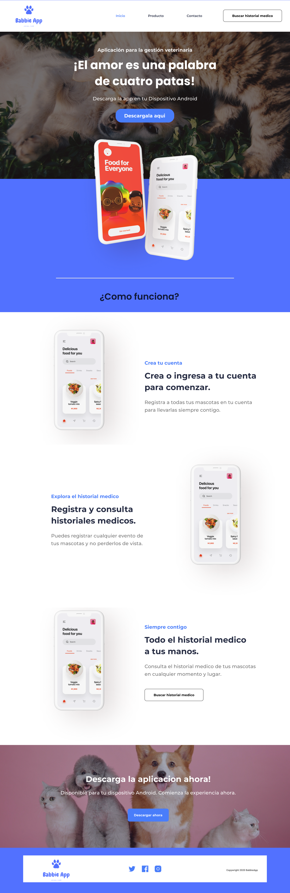
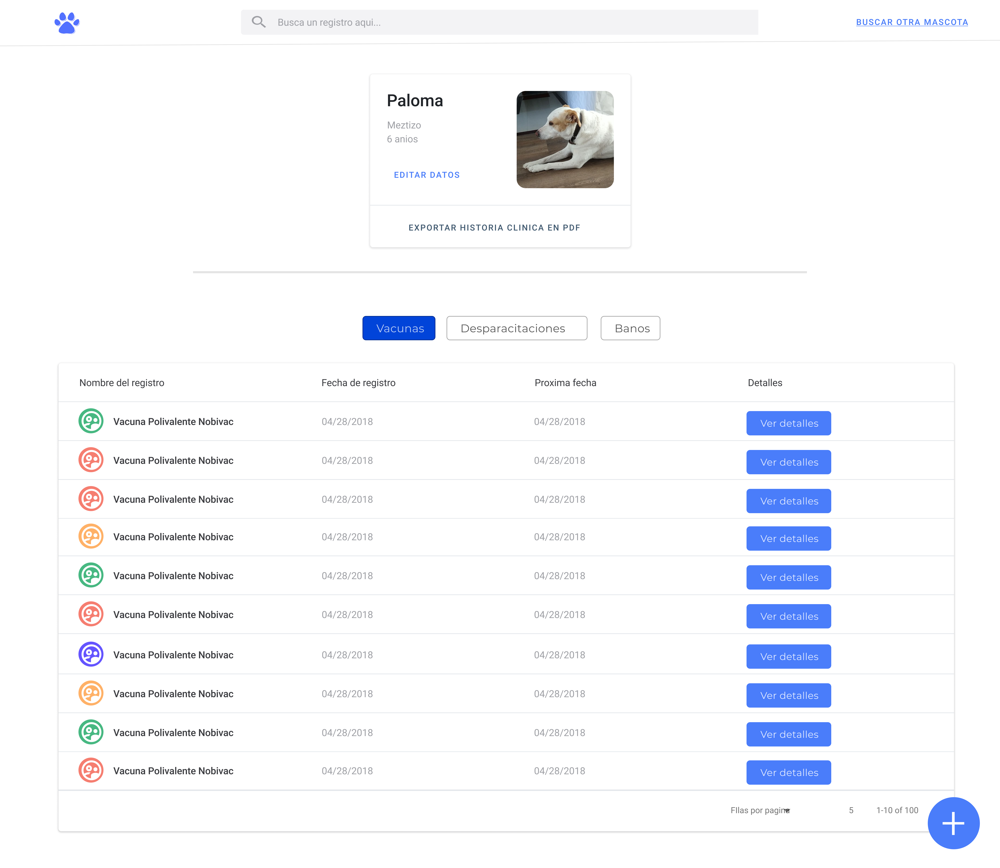
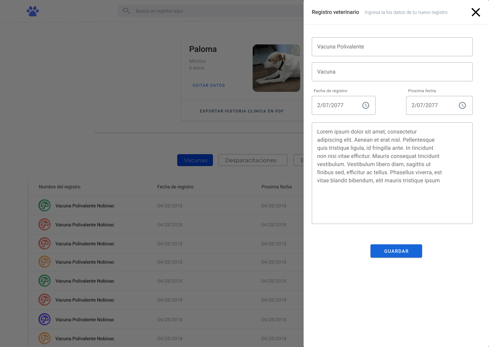

## BabbieApp-Pet Manager-Web module
This is an App which makes it easier to take care of pets

> #### Index
&ensp;
> #### Pet module
&ensp;

> #### Register vaccine
&ensp;

---

## Developed by
Julian Castellanos

---

## More about technologies and libraries on this proyect
> - [ReactJS](https://reactjs.org/)
> - [MaterialUI](https://material-ui.com/)
> - [Jest](https://jestjs.io/)
> - [Enzyme](https://enzymejs.github.io/enzyme/)
